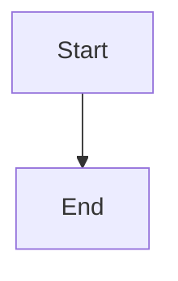

# mddoco

A CLI tool that converts markdown files to a single HTML (or future PDF) document.

## Installation

```bash
pip install mddoco
playwright install chromium
```

Or for development:

```bash
pip install -e .
playwright install chromium
```

> Playwright (Chromium) is required for PDF output only. HTML output works without it.

## Usage

```
mddoco [OPTIONS] INPUT_PATH
```

`INPUT_PATH` can be a **directory** (all `*.md` files are found recursively and sorted) or a **single `.md` file**.

### Options

| Option | Short | Default | Description |
|---|---|---|---|
| `--output PATH` | `-o` | `.` | Directory to write the output file |
| `--format [html\|pdf]` | `-f` | `html` | Output format |
| `--title TEXT` | `-t` | _(none)_ | Document title shown at the top of the page |
| `--theme NAME` | | `default` | Theme to use for rendering |
| `--toc / --no-toc` | | off | Generate a table of contents |
| `--toc-depth N` | | `3` | Maximum heading depth included in the TOC (1–6) |

### Examples

Convert all markdown files in a directory:

```bash
mddoco ./docs
```

Convert a single file:

```bash
mddoco README.md
```

With a title, TOC, and custom output directory:

```bash
mddoco ./docs --title "My Project" --toc --output ./out
```

## Output

All matched markdown files are combined into a single HTML document in the output directory. The filename is derived from the input folder or file name.

## Themes

Themes are self-contained Jinja2 HTML files with embedded CSS. Pass a theme name with `--theme NAME`.

| Theme | Description |
|---|---|
| `default` | Clean GitHub-style layout, 860 px centred column |
| `default-wide` | Same as `default` but full viewport width |
| `professional` | Corporate blue palette, dark title banner, card layout, 900 px centred |
| `professional-wide` | Same as `professional` but full viewport width |
| `dark` | Dark background, blue accent, light text — good for technical docs, 860 px centred |
| `dark-wide` | Same as `dark` but full viewport width |
| `academic` | Serif (Georgia) typography, justified text, print-optimised, 720 px centred |
| `academic-wide` | Same as `academic` but full viewport width |

All themes support:

- Optional document title
- Optional table of contents
- [Mermaid.js](https://mermaid.js.org) diagram support (loaded only when diagrams are present)
- Graph diagram blocks

### Graph diagrams

Use ` ```graph ` fenced blocks with a JSON payload. The only required field is `data`.

**Minimal example** — all defaults applied:

````markdown
```graph
{
  "data": {
    "x": ["Jan", "Feb", "Mar"],
    "Sales": [100, 150, 120]
  }
}
```
````

Series are inferred from the data keys (everything except `x`). Each series defaults to a line chart in blue.

**Full schema:**

| Field | Required | Default | Description |
|---|---|---|---|
| `data.x` | yes | — | Category labels |
| `data.<name>` | yes | — | Values for each series (one key per series) |
| `title` | no | _(none)_ | Chart title |
| `orientation` | no | `vertical` | `vertical` or `horizontal` |
| `show_legend` | no | `true` | Show the legend |
| `width_px` | no | `640` | Width in pixels |
| `height_px` | no | `480` | Height in pixels |
| `min` / `max` | no | — | Axis bounds |
| `series` | no | _(auto)_ | Override series definitions (see below) |

**Series fields** (all optional when auto-generated):

| Field | Default | Description |
|---|---|---|
| `label` | _(data key)_ | Must match a key in `data` |
| `type` | `line` | `bar`, `line` (solid), or `line2` (dotted) |
| `colour` | _(palette)_ | Colour string, or list of colours per bar |
| `marker` | `false` | Show point markers (line types only) |

**Full example:**

````markdown
```graph
{
  "title": "Sales vs Target",
  "orientation": "vertical",
  "show_legend": true,
  "data": {
    "x": ["Jan", "Feb", "Mar", "Apr", "May"],
    "Sales":  [85, 92, 78, 96, 110],
    "Target": [90, 90, 90, 90, 90]
  },
  "series": [
    { "label": "Sales",  "type": "bar",  "colour": "#3498db" },
    { "label": "Target", "type": "line", "colour": "#e74c3c", "marker": false }
  ]
}
```
````

### Mermaid diagrams

Use standard fenced code blocks in your markdown:

````markdown

````

mddoco detects mermaid blocks automatically and loads the Mermaid.js CDN only when needed.
