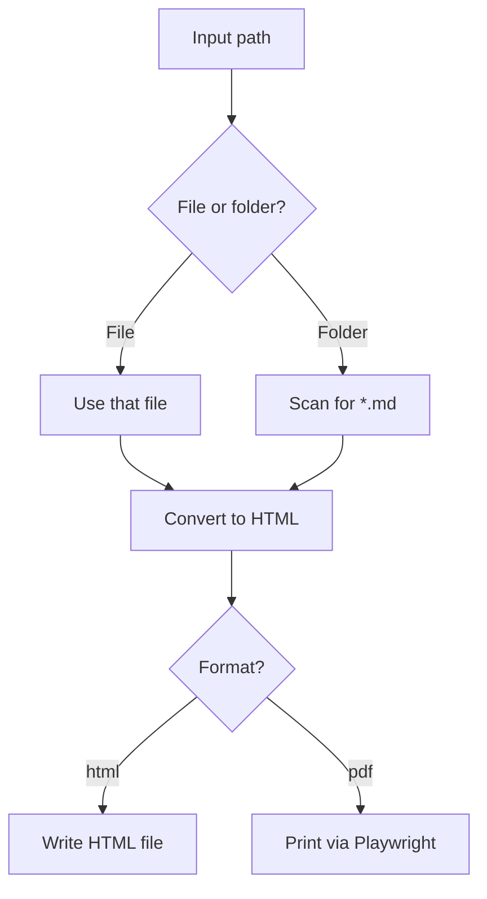
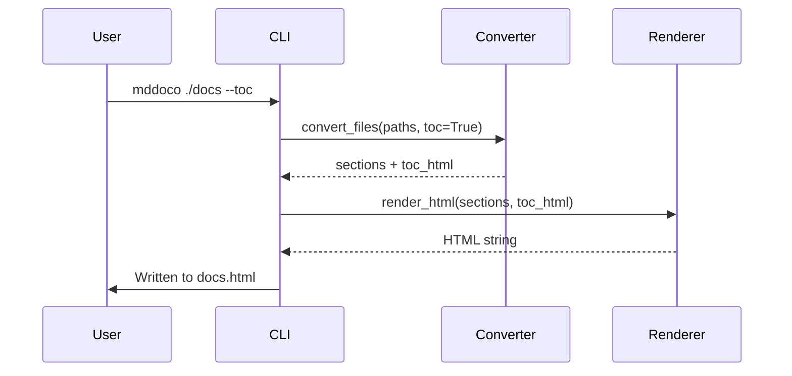

# Diagrams

## Mermaid flowchart

```mermaid
graph TD
    A[Input path] --> B{File or folder?}
    B -->|File| C[Use that file]
    B -->|Folder| D[Scan for *.md]
    C --> E[Convert to HTML]
    D --> E
    E --> F{Format?}
    F -->|html| G[Write HTML file]
    F -->|pdf| H[Print via Playwright]
```

## Mermaid sequence diagram

```mermaid
sequenceDiagram
    participant User
    participant CLI
    participant Converter
    participant Renderer

    User->>CLI: mddoco ./docs --toc
    CLI->>Converter: convert_files(paths, toc=True)
    Converter-->>CLI: sections + toc_html
    CLI->>Renderer: render_html(sections, toc_html)
    Renderer-->>CLI: HTML string
    CLI->>User: Written to docs.html
```
