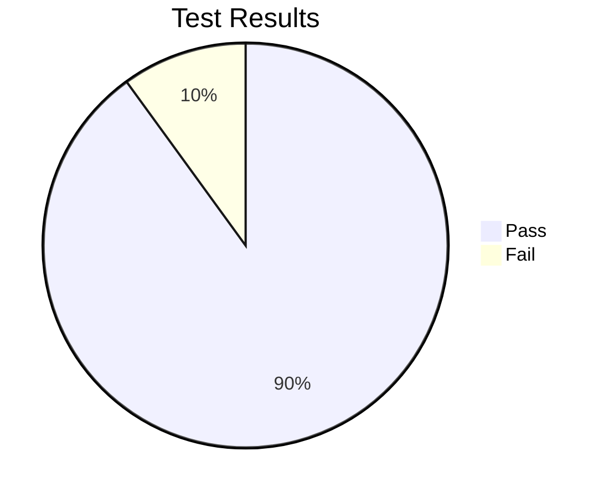

# Single File Test

This file is used to test single-file input mode.

## Section one

Some content here with **bold**, _italic_, and `inline code`.

### Subsection

A nested heading to verify TOC depth options.

## Section two

A table:

| Column A | Column B | Column C |
|----------|----------|----------|
| alpha    | beta     | gamma    |
| one      | two      | three    |

## Section three

A mermaid diagram to verify CDN loading in single-file mode:

